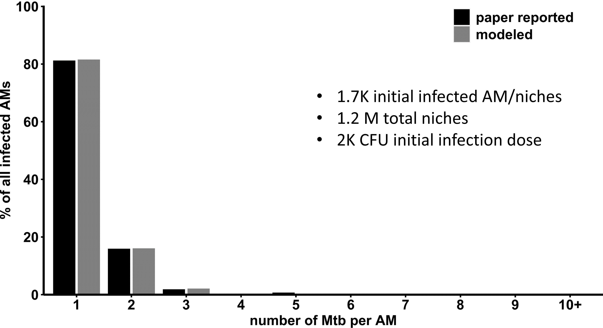

# 💨 Modeling the deposition of infectious agents suggests that aerosolized drugs offer enhanced specificity

> 💡 **Tip: [Please find **👉 MY BLOG** for an introduction to the project, along with the detailed mathematical and biological reasoning behind the code in this repository.](https://myhugoblog)**

## Introduction
Alveolar deposition is indeed a key event in respiratory infections, including pneumonia and viral infections like COVID-19. It allows many infectious agents (like bacteria, viruses, and fungi) to establish infection and cause damage to the lungs and overall health. Aerosols of 1–5 microns in diameter are able to bypass the upper airways and reach the deep parts of the lungs, including the alveoli. It is through aerosols that respiratory diseases like COVID-19, tuberculosis, and influenza spread so effectively.

I thought the small size of aerosols that deeply reach alveoli made them subject to [Brownian motion](https://en.wikipedia.org/wiki/Brownian_motion) and deposit in a random, erratic pattern. But the Fig 1D of [Rothchild et al.,(2019)](https://pmc.ncbi.nlm.nih.gov/articles/PMC6910245/) strongly challenged this idea. Specifically, the mice were infected with 2 × 10^3^ aerosolized tuberculosis bateria (M.tb), and one day later more than 15% of the infected alveoli contained two bacteria. Considering the [36-hour douling time of M.tb](https://pmc.ncbi.nlm.nih.gov/articles/PMC2779834/) even in rich growth conditions, we can reasonably ignore M.tb proliferation within the first day, during which the bacteria must acclimate to the immunocompetent lung environment. The frequency, therefore, does not align with the assumption that M.tb deposits randomly in each infection niche—the region surveilled by one of the more than 7 × 10⁵ individual alveolar macrophages—at the same probability.

I will demonstrate below that random niche deposition cannot recapitulate the results shown in [Fig 1D](https://pmc.ncbi.nlm.nih.gov/articles/PMC6910245/), however, preferential deposition in certain niches successfully reproduces the findings. This suggests that infectious agents affect alveoli unevenly, and precision medicine should account for this variability to achieve satisfactory specificity and efficacy. Aerosolized drugs with similar deposition patterns are expected to be more advantageous compared to the same drugs delivered by other routes. 

## Computation methods
Please see complete description in [**👉 MY BLOG**](https://myhugoblog). Briefly, 
### 1. Random deposition is modeled as
$$
p N_{niche} = 1
$$
### 2.Preferred deposition is modeled as
$$
\underset{f(x)}{\text{arg max}} \, L(f(x) \mid d_0)
$$
#### 
$$
\begin{equation}
f(x_i) =
\begin{cases} 
P_1, & \forall i \in [1, N_{P1}] \\
P_2, & \forall i \in (N_{P1}, N_{\text{niche}}]
\end{cases}
\end{equation}
$$

## Results

As a result, Monte Carlo simulation using the $f(x)$ of max likelihood gives a **nealy same result** as reported in the Fig 1D of [Rothchild et al.,(2019)](https://pmc.ncbi.nlm.nih.gov/articles/PMC6910245/).

We can continue to predict the the number of alveolar macrophages initially infected varied with infection dose, and what infection dose can cause acute symptomatic infection. Below animation demonstrates the prediction.

