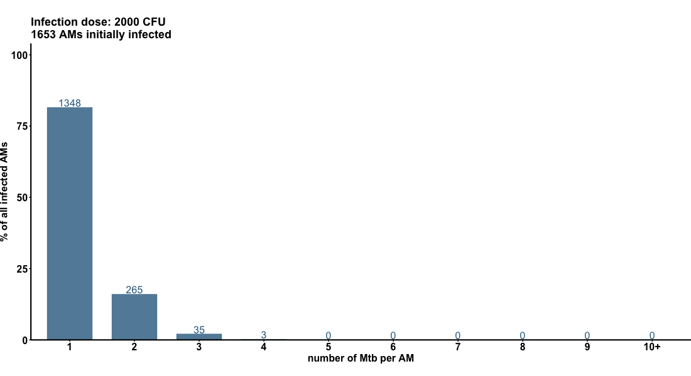

# 💨 Modeling the deposition of infectious agents suggests that aerosolized drugs offer enhanced specificity

> 💡 **Tip: [Please find **👉 MY BLOG** for an introduction to the project, along with the detailed mathematical and biological reasoning behind the code in this repository.](https://jiyuanliu.netlify.app/post/00.model_aerosol_depostion/)**

## Introduction
### 🌬️ Alveolar Deposition & Respiratory Infections

Alveolar deposition is a **key event** in respiratory infections, including pneumonia and viral diseases like **COVID-19**. It allows many infectious agents — bacteria, viruses, and fungi — to establish infection and damage the lungs and overall health. Aerosols of **1–5 microns** in diameter can bypass the upper airways and reach the deep lung regions, including the alveoli. Through these aerosols, respiratory diseases such as COVID-19, tuberculosis, and influenza spread **very effectively**.

### 🤔 Initial Assumption: Random Deposition

I thought the small aerosols that reach alveoli would be subject to [Brownian motion](https://en.wikipedia.org/wiki/Brownian_motion) and deposit in a **random, erratic pattern**.

### 🔍 What the Data Shows

But [Fig 1D from Rothchild et al., (2019)](https://pmc.ncbi.nlm.nih.gov/articles/PMC6910245/) strongly challenges this:

- Mice infected with **2 × 10³** aerosolized tuberculosis bacteria (*M.tb*)  
- After just **1 day**, over **15%** of infected alveoli contained **two bacteria** each!

Considering the [36-hour doubling time of *M.tb*](https://pmc.ncbi.nlm.nih.gov/articles/PMC2779834/) even in ideal growth conditions, bacterial growth can be ignored during this period — the bacteria need time to acclimate in the immune-competent lung environment. 

### ⚠️ What This Means

The observed frequency **does not match** the idea of random deposition. If *M.tb* settled randomly, each infection niche — the area patrolled by one of more than **7 × 10⁵** alveolar macrophages — would have the same chance of infection. That’s clearly **not happening**.

### 📊 Summary & Implications

I’ll show below that:

- **Random niche deposition cannot explain** the experimental results  
- **Preferential deposition in certain niches reproduces** the observed patterns

This suggests infectious agents affect alveoli **unevenly**, and precision medicine should consider this variability to improve **specificity and efficacy**. Aerosolized drugs that mimic these deposition patterns may offer better outcomes compared to other delivery routes.

## Computation methods
Please see complete description in [**👉 MY BLOG**](https://jiyuanliu.netlify.app/post/00.model_aerosol_depostion/). Briefly, 
### 1. Random deposition is modeled as
$$
p N_{niche} = 1
$$
### 2.Preferred deposition is modeled as
$$
\underset{f(x)}{\text{arg max}} \, L(f(x) \mid d_0)
$$
#### 
$$
\begin{equation}
f(x_i) =
\begin{cases} 
P_1, & \forall i \in [1, N_{P1}] \\
P_2, & \forall i \in (N_{P1}, N_{\text{niche}}]
\end{cases}
\end{equation}
$$

## Results
### Prefered depostion model recaps real world data accurately
As a result, Monte Carlo simulation using the $f(x)$ of max likelihood gives a **nealy same result** as reported in the Fig 1D of [Rothchild et al.,(2019)](https://pmc.ncbi.nlm.nih.gov/articles/PMC6910245/).

### Predict the infection doses allowing asymptomatic infection
We can continue to predict the the number of alveolar macrophages initially infected varied with infection dose, and what infection dose can cause acute symptomatic infection. Below animation demonstrates the prediction.

